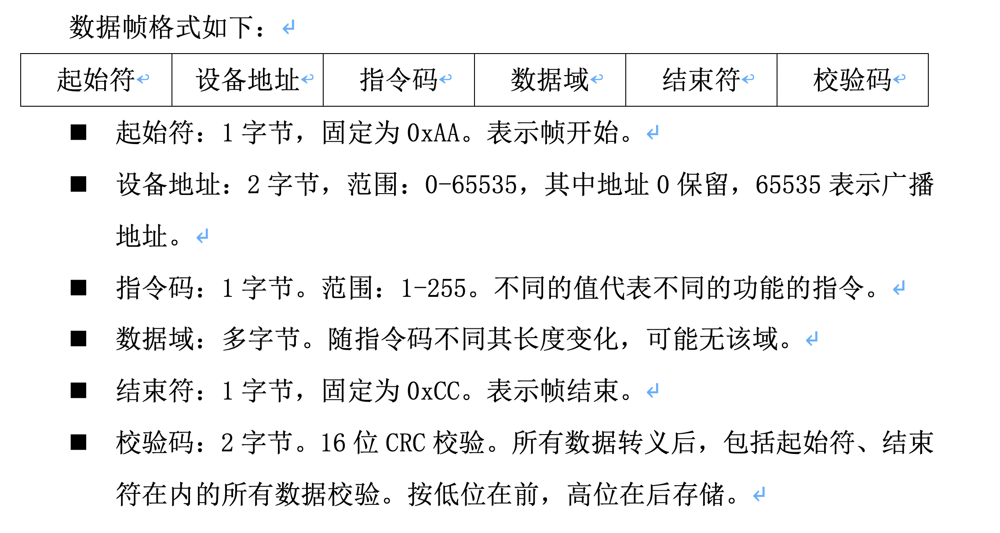

### Netty下不固定的Delimiter的拆包处理

最近做项目有一个通讯协议，在其`结束符`后还有两个字节的`校验符号`



> 如图所示，`结束符`后的`校验码`的值是变化的

而`Netty`自带的`DelimiterBasedFrameDecoder`可以支持结束符拆包但是不支持目前这种情况。我们通过对`DelimiterBasedFrameDecoder`进行简单的修改实现。

新建类 `io.netty.handler.codec.AdditionalDelimiterBasedFrameDecoder`，将`io.netty.handler.codec.DelimiterBasedFrameDecoder`代码拷贝其中，找到：

``` java
int minDelimLength = minDelim.capacity();
```

修改为：

``` java
int minDelimLength = minDelim.capacity();
final int checkLength = 2;
minDelimLength = minDelimLength + checkLength;

```
原理很简单，将原有的`分隔符`的长度增加两个字节，将后面两位`校验码`包含进去。

声明使用:

``` java
new AdditionalDelimiterBasedFrameDecoder(4096, Unpooled.copiedBuffer(Unpooled.buffer(1).writeByte(0xCC).array())
```

源码地址：[https://github.com/wiselyman/netty4-server.git](https://github.com/wiselyman/netty4-server.git)
